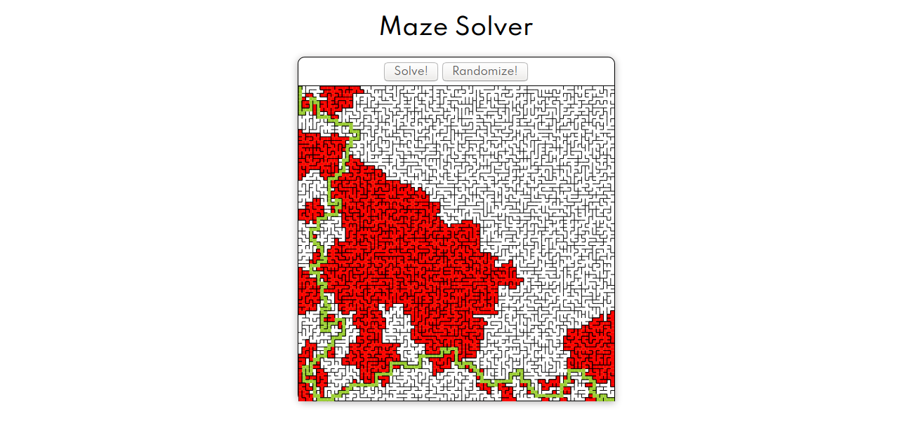
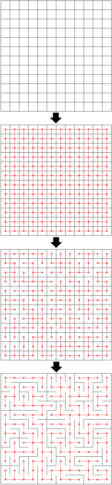

# Maze Solver
## Description

A simple maze solver/generator I did to improve my javascript and to play with some graphs.

## How are mazes born?

1. First, we start with an *NxN* grid of squares. 
1. From it, we construct a graph *G* where each vertex corresponds to a square and two vertices are adjacent if and only if their corresponding squares have a common side. 
1. Then, we must find a spanning tree in *G*, to do so I attributed random positive weights to its edges and used Kruskal's minimum spanning tree algorithm. 
1. Then, to complete the process, we need only to erase the segments of the grid that intersect with the edges of the spanning tree obtained.
## Ok... but how do I get out?
We just do a depth-first search on the graph that represents the maze. Notice that, since the maze is a tree, the path between its start and end is unique, therefore the path obtained is also the shortest.
## To-do list
* Improve the maze generation algorithm.
